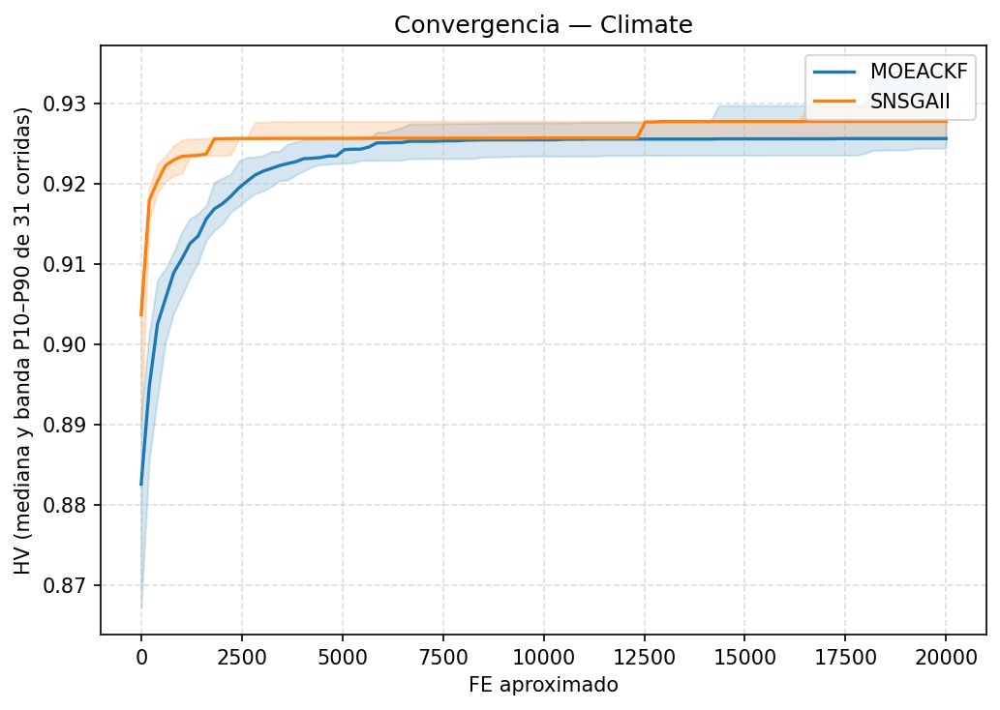

## Dataset 2 (Climate)

### Curva de convergencia

### Velocidad de convergencia

**FE hasta 95% del HV final (indicador principal, entra en la corrección Holm-Bonferroni de la familia `principal_snn`):**

N = 31 corridas pareadas por seed.

| Grupo | FE hasta 95% del HV final (mediana [IQR]) | Media ± DE | p-valor (Wilcoxon signed-rank) | Â₁₂ |
|---|---|---|---|---|
| MOEACKF | 0.0000 [0.0000, 127.3885] | 73.9675 ± 85.6078 | — | — |
| SNSGAII | 0.0000 [0.0000, 0.0000] | 9.7260 ± 39.8210 | 0.0004751* | 0.694 |

Shapiro-Wilk p (informativo): MOEACKF=6.305e-06, SNSGAII=2.481e-11.

**FE hasta 90% del HV final (chequeo de sensibilidad; no se corrige aparte por su redundancia con el de 95% -- misma trayectoria, mismo run):**

N = 31 corridas pareadas por seed.

| Grupo | FE hasta 90% del HV final (mediana [IQR]) | Media ± DE | p-valor (Wilcoxon signed-rank) | Â₁₂ |
|---|---|---|---|---|
| MOEACKF | 0.0000 [0.0000, 0.0000] | 0.0000 ± 0.0000 | — | — |
| SNSGAII | 0.0000 [0.0000, 0.0000] | 0.0000 ± 0.0000 | 1 | 0.500 |

Shapiro-Wilk p (informativo): MOEACKF=1, SNSGAII=1.
MOEACKF y SNSGAII son idénticos en los 31 pares (diferencia cero en todas las corridas) -- no aplica el test de Wilcoxon, se reporta p=1.0 por convención.