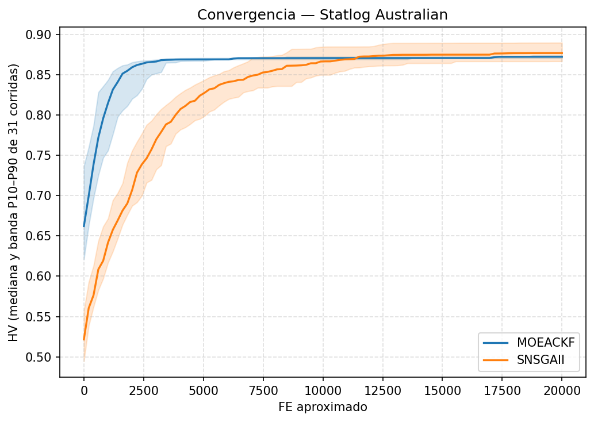
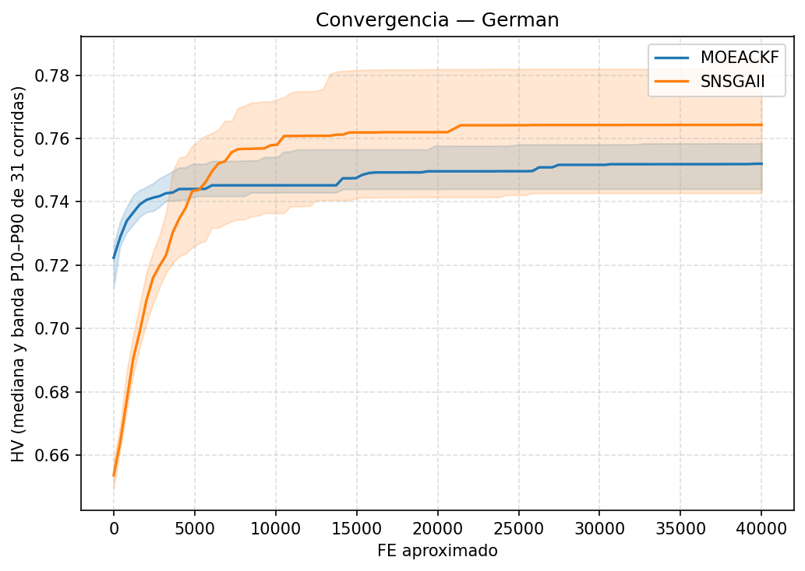
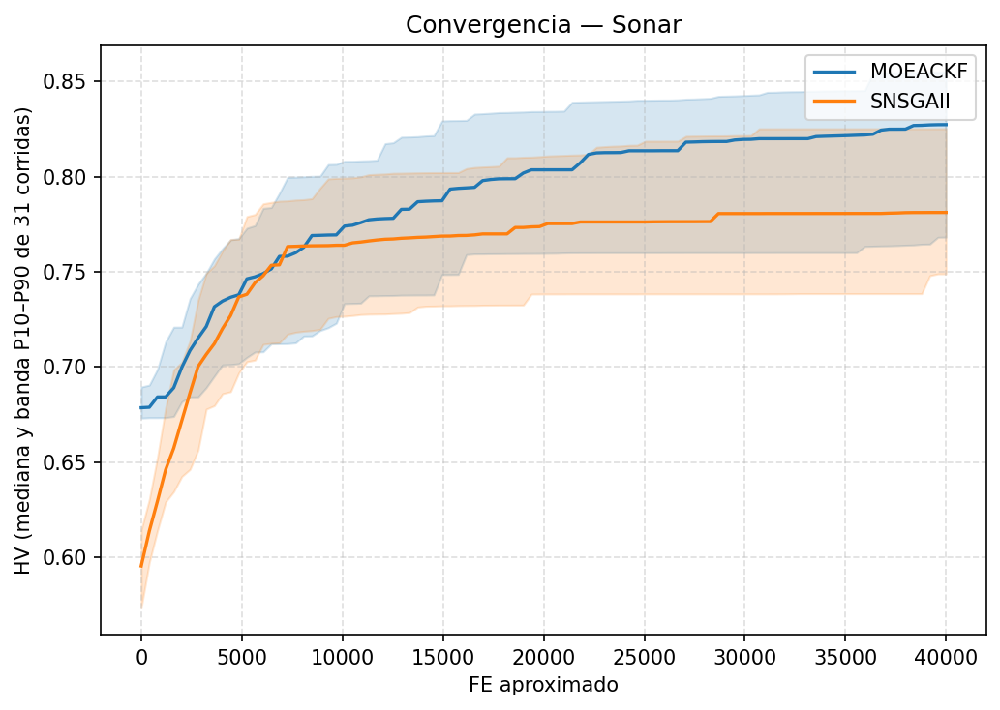

# Convergencia — MOEACKF vs SNSGAII (normal_results)

## Dataset 1 (Statlog Australian)

### Curva de convergencia

### Velocidad de convergencia

**FE hasta 95% del HV final (indicador principal, entra en la corrección Holm-Bonferroni de la familia `principal_snn`):**

N = 31 corridas pareadas por seed.

| Grupo | FE hasta 95% del HV final (mediana [IQR]) | Media ± DE | p-valor (Wilcoxon signed-rank) | Â₁₂ |
|---|---|---|---|---|
| MOEACKF | 1212.1212 [969.6970, 1515.1515] | 1380.2542 ± 651.0023 | — | — |
| SNSGAII | 5226.1307 [5025.1256, 6733.6683] | 5874.5340 ± 1377.7373 | 9.313e-10* | 0.000 |

Shapiro-Wilk p (informativo): MOEACKF=0.008569, SNSGAII=0.001079.

**FE hasta 90% del HV final (chequeo de sensibilidad; no se corrige aparte por su redundancia con el de 95% -- misma trayectoria, mismo run):**

N = 31 corridas pareadas por seed.

| Grupo | FE hasta 90% del HV final (mediana [IQR]) | Media ± DE | p-valor (Wilcoxon signed-rank) | Â₁₂ |
|---|---|---|---|---|
| MOEACKF | 727.2727 [606.0606, 1090.9091] | 922.7761 ± 581.8833 | — | — |
| SNSGAII | 3417.0854 [3015.0754, 4020.1005] | 3663.4787 ± 783.1628 | 1.863e-09* | 0.032 |

Shapiro-Wilk p (informativo): MOEACKF=5.153e-06, SNSGAII=0.02541.

## Dataset 2 (Climate)

### Curva de convergencia

### Velocidad de convergencia

**FE hasta 95% del HV final (indicador principal, entra en la corrección Holm-Bonferroni de la familia `principal_snn`):**

N = 31 corridas pareadas por seed.

| Grupo | FE hasta 95% del HV final (mediana [IQR]) | Media ± DE | p-valor (Wilcoxon signed-rank) | Â₁₂ |
|---|---|---|---|---|
| MOEACKF | 0.0000 [0.0000, 127.3885] | 73.9675 ± 85.6078 | — | — |
| SNSGAII | 0.0000 [0.0000, 0.0000] | 9.7260 ± 39.8210 | 0.0004751* | 0.694 |

Shapiro-Wilk p (informativo): MOEACKF=6.305e-06, SNSGAII=2.481e-11.

**FE hasta 90% del HV final (chequeo de sensibilidad; no se corrige aparte por su redundancia con el de 95% -- misma trayectoria, mismo run):**

N = 31 corridas pareadas por seed.

| Grupo | FE hasta 90% del HV final (mediana [IQR]) | Media ± DE | p-valor (Wilcoxon signed-rank) | Â₁₂ |
|---|---|---|---|---|
| MOEACKF | 0.0000 [0.0000, 0.0000] | 0.0000 ± 0.0000 | — | — |
| SNSGAII | 0.0000 [0.0000, 0.0000] | 0.0000 ± 0.0000 | 1 | 0.500 |

Shapiro-Wilk p (informativo): MOEACKF=1, SNSGAII=1.
MOEACKF y SNSGAII son idénticos en los 31 pares (diferencia cero en todas las corridas) -- no aplica el test de Wilcoxon, se reporta p=1.0 por convención.

## Dataset 3 (German)

### Curva de convergencia

### Velocidad de convergencia

**FE hasta 95% del HV final (indicador principal, entra en la corrección Holm-Bonferroni de la familia `principal_snn`):**

N = 31 corridas pareadas por seed.

| Grupo | FE hasta 95% del HV final (mediana [IQR]) | Media ± DE | p-valor (Wilcoxon signed-rank) | Â₁₂ |
|---|---|---|---|---|
| MOEACKF | 0.0000 [0.0000, 0.0000] | 37.3898 ± 81.3532 | — | — |
| SNSGAII | 3408.5213 [2456.1404, 3909.7744] | 3250.0606 ± 953.7954 | 9.313e-10* | 0.000 |

Shapiro-Wilk p (informativo): MOEACKF=7.935e-09, SNSGAII=0.6517.

**FE hasta 90% del HV final (chequeo de sensibilidad; no se corrige aparte por su redundancia con el de 95% -- misma trayectoria, mismo run):**

N = 31 corridas pareadas por seed.

| Grupo | FE hasta 90% del HV final (mediana [IQR]) | Media ± DE | p-valor (Wilcoxon signed-rank) | Â₁₂ |
|---|---|---|---|---|
| MOEACKF | 0.0000 [0.0000, 0.0000] | 0.0000 ± 0.0000 | — | — |
| SNSGAII | 1203.0075 [902.2556, 1503.7594] | 1190.0720 ± 479.9077 | 9.313e-10* | 0.000 |

Shapiro-Wilk p (informativo): MOEACKF=1, SNSGAII=0.4843.

## Dataset 4 (Sonar)

### Curva de convergencia

### Velocidad de convergencia

**FE hasta 95% del HV final (indicador principal, entra en la corrección Holm-Bonferroni de la familia `principal_snn`):**

N = 31 corridas pareadas por seed.

| Grupo | FE hasta 95% del HV final (mediana [IQR]) | Media ± DE | p-valor (Wilcoxon signed-rank) | Â₁₂ |
|---|---|---|---|---|
| MOEACKF | 13626.3736 [10622.7106, 18901.0989] | 14363.7008 ± 5291.3162 | — | — |
| SNSGAII | 5614.0351 [4110.2757, 6416.0401] | 6089.4171 ± 3580.2218 | 9.162e-06* | 0.903 |

Shapiro-Wilk p (informativo): MOEACKF=0.2127, SNSGAII=6.059e-06.

**FE hasta 90% del HV final (chequeo de sensibilidad; no se corrige aparte por su redundancia con el de 95% -- misma trayectoria, mismo run):**

N = 31 corridas pareadas por seed.

| Grupo | FE hasta 90% del HV final (mediana [IQR]) | Media ± DE | p-valor (Wilcoxon signed-rank) | Â₁₂ |
|---|---|---|---|---|
| MOEACKF | 5128.2051 [4029.3040, 6739.9267] | 5260.5459 ± 2587.3303 | — | — |
| SNSGAII | 3208.0201 [2406.0150, 4461.1529] | 3366.4807 ± 1557.9808 | 0.003597* | 0.774 |

Shapiro-Wilk p (informativo): MOEACKF=0.726, SNSGAII=0.02152.