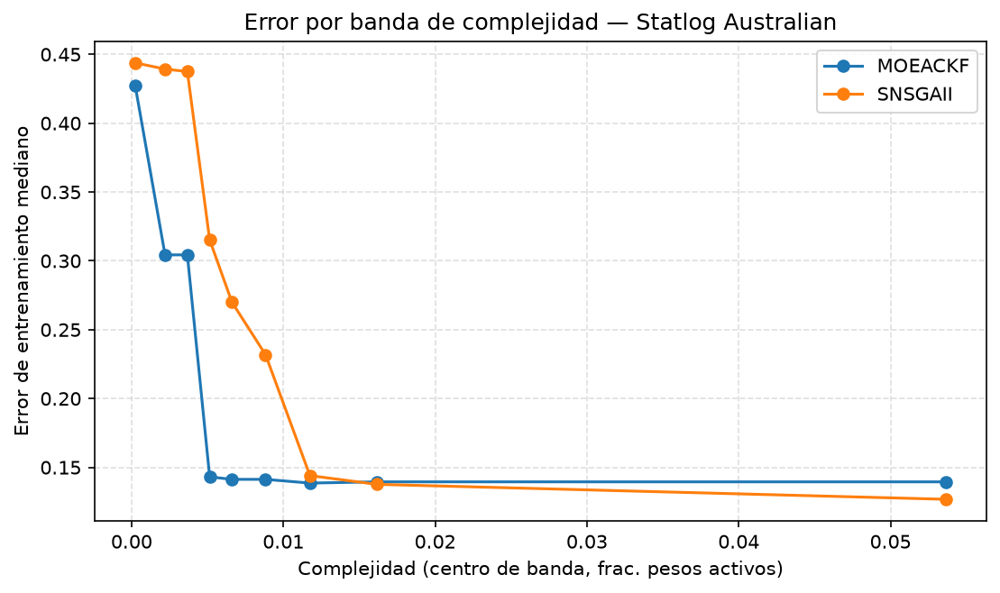

## Dataset 1 (Statlog Australian) — error mediano por banda de complejidad

Deciles de complejidad (`f1_complexity`) sobre el pool de puntos crudos de ambos algoritmos (10 bandas solicitadas; pueden colapsar menos por empates en los bordes, frecuente porque 14.5% de los puntos tienen complejidad exactamente 0).

| Banda de complejidad | MOEACKF error mediano (n) | SNSGAII error mediano (n) |
|---|---|---|
| (-0.001, 0.00147] | 0.4275 (58) | 0.4438 (50) |
| (0.00147, 0.00294] | 0.3043 (31) | 0.4393 (10) |
| (0.00294, 0.00441] | 0.3043 (18) | 0.4375 (6) |
| (0.00441, 0.00588] | 0.1431 (31) | 0.3152 (9) |
| (0.00588, 0.00735] | 0.1413 (14) | 0.2699 (21) |
| (0.00735, 0.0103] | 0.1413 (14) | 0.2319 (44) |
| (0.0103, 0.0132] | 0.1386 (4) | 0.1440 (28) |
| (0.0132, 0.0191] | 0.1395 (7) | 0.1377 (23) |
| (0.0191, 0.0882] | 0.1395 (1) | 0.1268 (37) |

