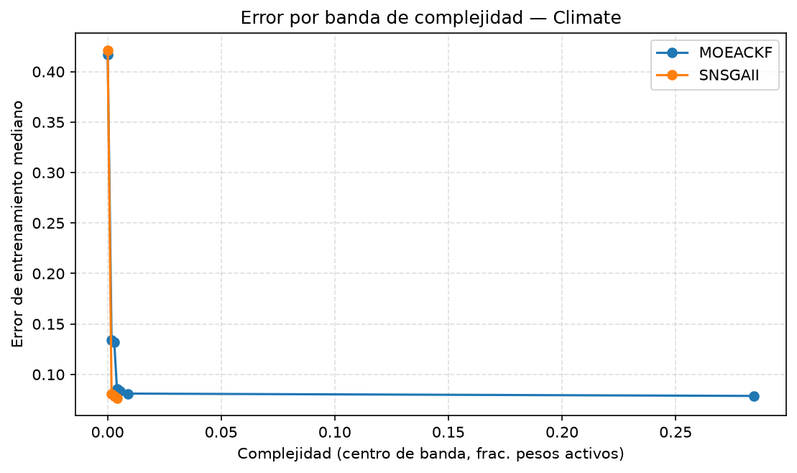

## Dataset 2 (Climate) — error mediano por banda de complejidad

Deciles de complejidad (`f1_complexity`) sobre el pool de puntos crudos de ambos algoritmos (10 bandas solicitadas; pueden colapsar menos por empates en los bordes, frecuente porque 19.9% de los puntos tienen complejidad exactamente 0).

| Banda de complejidad | MOEACKF error mediano (n) | SNSGAII error mediano (n) |
|---|---|---|
| (-0.001, 0.00119] | 0.4167 (56) | 0.4213 (53) |
| (0.00119, 0.00238] | 0.1343 (31) | 0.0810 (31) |
| (0.00238, 0.00357] | 0.1319 (19) | 0.0787 (19) |
| (0.00357, 0.00476] | 0.0856 (30) | 0.0764 (3) |
| (0.00476, 0.00595] | 0.0833 (12) | — (0) |
| (0.00595, 0.0119] | 0.0810 (28) | — (0) |
| (0.0119, 0.557] | 0.0787 (29) | — (0) |

