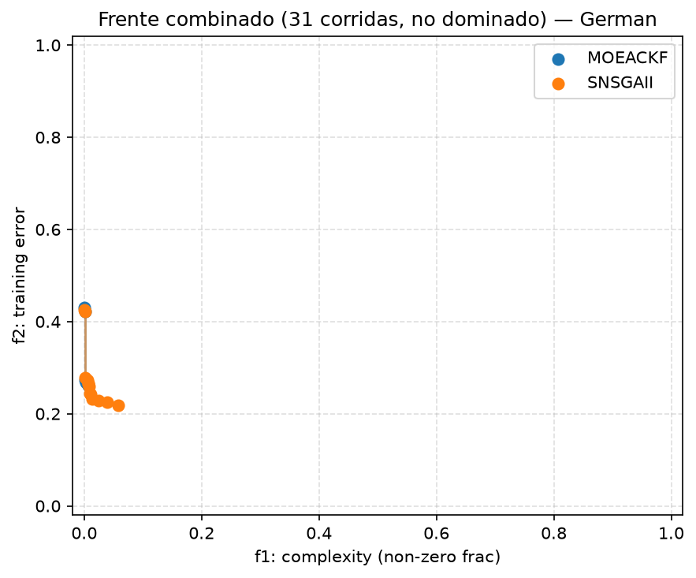

## Dataset 3 (German) — frente combinado y C-metric

Unión de las 31 corridas por algoritmo, deduplicada y filtrada a no-dominados (dominancia estricta).

| Métrica | Valor |
|---|---|
| Tamaño frente combinado MOEACKF | 6 |
| Tamaño frente combinado SNSGAII | 13 |
| C(MOEACKF, SNSGAII) — fracción del frente SNSGAII cubierta (dominada o igualada) por el frente MOEACKF | 0.308 |
| C(SNSGAII, MOEACKF) — fracción del frente MOEACKF cubierta por el frente SNSGAII | 0.333 |

