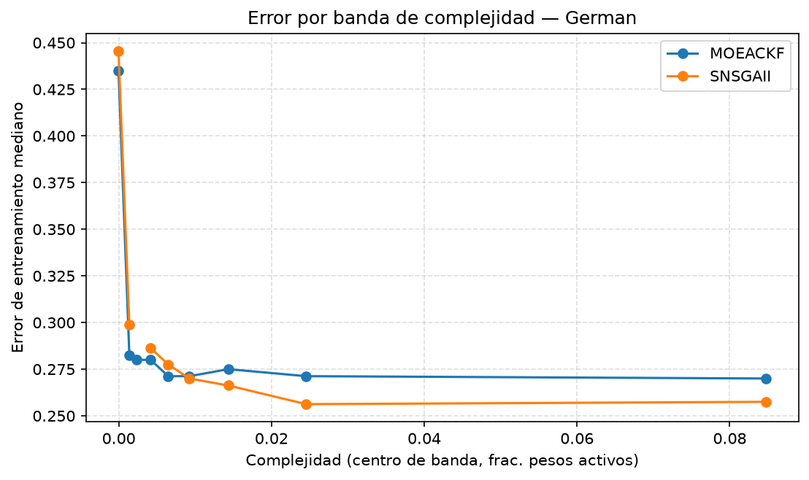

## Dataset 3 (German) — error mediano por banda de complejidad

Deciles de complejidad (`f1_complexity`) sobre el pool de puntos crudos de ambos algoritmos (10 bandas solicitadas; pueden colapsar menos por empates en los bordes, frecuente porque 13.7% de los puntos tienen complejidad exactamente 0).

| Banda de complejidad | MOEACKF error mediano (n) | SNSGAII error mediano (n) |
|---|---|---|
| (-0.001, 0.000926] | 0.4350 (55) | 0.4456 (56) |
| (0.000926, 0.00185] | 0.2825 (31) | 0.2988 (31) |
| (0.00185, 0.00278] | 0.2800 (20) | — (0) |
| (0.00278, 0.00556] | 0.2800 (21) | 0.2863 (31) |
| (0.00556, 0.00741] | 0.2712 (4) | 0.2775 (26) |
| (0.00741, 0.0111] | 0.2712 (7) | 0.2700 (41) |
| (0.0111, 0.0176] | 0.2750 (5) | 0.2662 (39) |
| (0.0176, 0.0315] | 0.2712 (11) | 0.2562 (31) |
| (0.0315, 0.138] | 0.2700 (17) | 0.2575 (28) |

