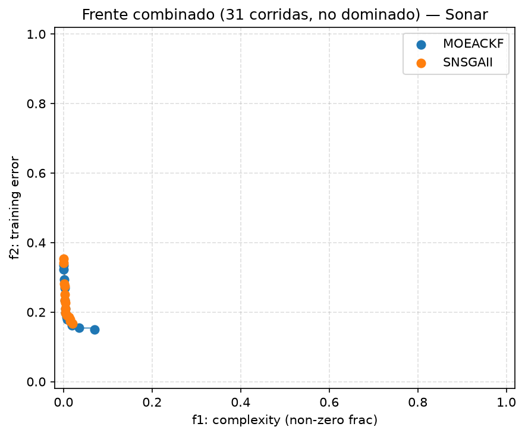
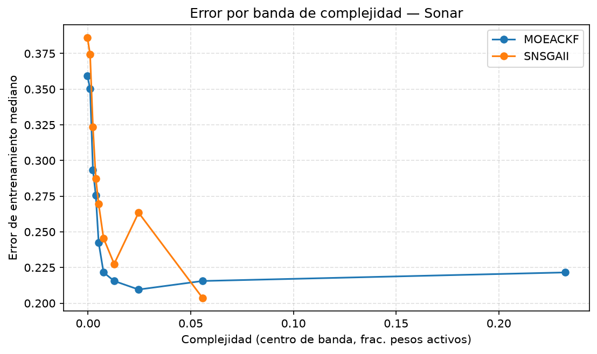

# Frentes de Pareto — MOEACKF vs SNSGAII (normal_results)

## Dataset 4 (Sonar) — solución de mejor accuracy por corrida

### Complejidad de la mejor red (frac. pesos activos)

N = 31 corridas pareadas por seed.

| Grupo | Complejidad de la mejor red (frac. pesos activos) (mediana [IQR]) | Media ± DE | p-valor (Wilcoxon signed-rank) | Â₁₂ |
|---|---|---|---|---|
| MOEACKF | 0.0429 [0.0208, 0.0847] | 0.0792 ± 0.0953 | — | — |
| SNSGAII | 0.0159 [0.0077, 0.0270] | 0.0188 ± 0.0141 | 0.0002673* | 0.742 |

Shapiro-Wilk p (informativo): MOEACKF=2.584e-06, SNSGAII=0.01256.

### Error de entrenamiento de la mejor red

N = 31 corridas pareadas por seed.

| Grupo | Error de entrenamiento de la mejor red (mediana [IQR]) | Media ± DE | p-valor (Wilcoxon signed-rank) | Â₁₂ |
|---|---|---|---|---|
| MOEACKF | 0.1796 [0.1677, 0.1976] | 0.1876 ± 0.0327 | — | — |
| SNSGAII | 0.2395 [0.2126, 0.2635] | 0.2403 ± 0.0417 | 4.766e-05* | 0.194 |

Shapiro-Wilk p (informativo): MOEACKF=0.0002955, SNSGAII=0.1685.

### Tamaño del frente (# soluciones no dominadas)

N = 31 corridas pareadas por seed.

| Grupo | Tamaño del frente (# soluciones no dominadas) (mediana [IQR]) | Media ± DE | p-valor (Wilcoxon signed-rank) | Â₁₂ |
|---|---|---|---|---|
| MOEACKF | 12.0000 [9.0000, 13.0000] | 11.2581 ± 3.2758 | — | — |
| SNSGAII | 8.0000 [7.0000, 10.5000] | 8.7097 ± 3.4370 | 0.01656* | 0.645 |

Shapiro-Wilk p (informativo): MOEACKF=0.7447, SNSGAII=0.8233.

## Dataset 4 (Sonar) — frente combinado y C-metric

Unión de las 31 corridas por algoritmo, deduplicada y filtrada a no-dominados (dominancia estricta).

| Métrica | Valor |
|---|---|
| Tamaño frente combinado MOEACKF | 14 |
| Tamaño frente combinado SNSGAII | 14 |
| C(MOEACKF, SNSGAII) — fracción del frente SNSGAII cubierta (dominada o igualada) por el frente MOEACKF | 0.857 |
| C(SNSGAII, MOEACKF) — fracción del frente MOEACKF cubierta por el frente SNSGAII | 0.143 |

## Dataset 4 (Sonar) — error mediano por banda de complejidad

Deciles de complejidad (`f1_complexity`) sobre el pool de puntos crudos de ambos algoritmos (10 bandas solicitadas; pueden colapsar menos por empates en los bordes, frecuente porque 8.1% de los puntos tienen complejidad exactamente 0).

| Banda de complejidad | MOEACKF error mediano (n) | SNSGAII error mediano (n) |
|---|---|---|
| (-0.001, 0.000397] | 0.3593 (59) | 0.3862 (38) |
| (0.000397, 0.00159] | 0.3503 (2) | 0.3743 (28) |
| (0.00159, 0.00317] | 0.2934 (23) | 0.3234 (51) |
| (0.00317, 0.00437] | 0.2754 (22) | 0.2874 (39) |
| (0.00437, 0.00595] | 0.2425 (26) | 0.2695 (33) |
| (0.00595, 0.00913] | 0.2216 (23) | 0.2455 (32) |
| (0.00913, 0.0163] | 0.2156 (29) | 0.2275 (29) |
| (0.0163, 0.0329] | 0.2096 (48) | 0.2635 (13) |
| (0.0329, 0.0787] | 0.2156 (55) | 0.2036 (7) |
| (0.0787, 0.386] | 0.2216 (62) | — (0) |

